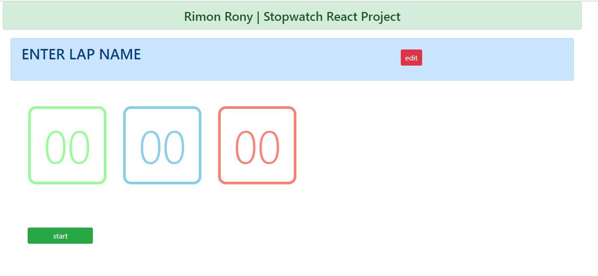

<h3>React JS project | Modern Stopwatch</h3>

<h4>Technology used:</h4>
<ul>
  <li>HTML & CSS</li>
  <li>Javascript</li>
  <li>Bootstrap</li>
  <li>React</li>
</ul>

<h4>How to install</h4>
<ul>
  <li>Install node js</li>
  <li>Make a react app</li>
  <li>Add the components to the source</li>
  <li>Alter Index.htm, Index.js, App.js files with installed same files</li>
</ul>
